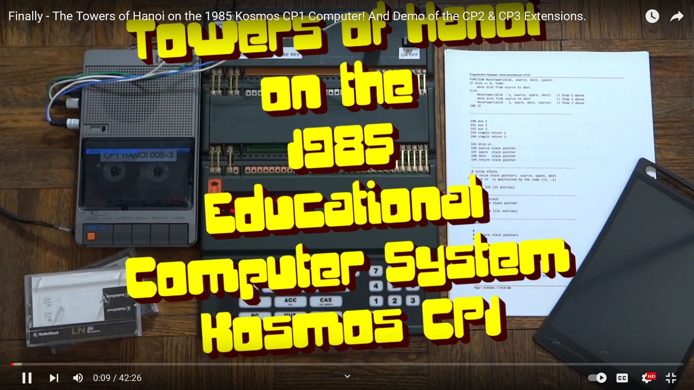
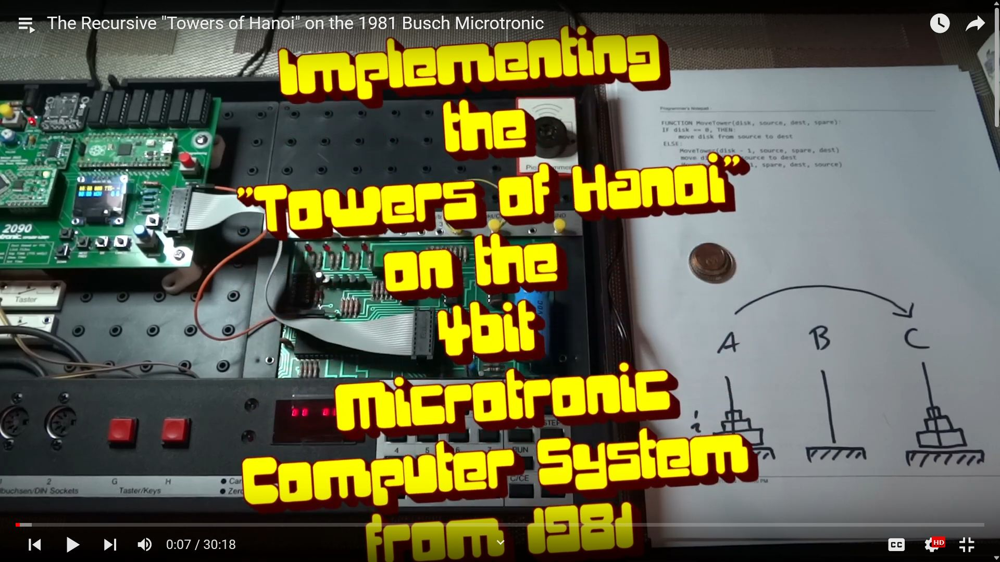

# Towers of Hanoi

The infamous Towers of Hanoi, demonstrating tree recursion,
implemented on the early 1980s educational computer systems

- Busch Microtronic 2090 (from 1981) 
- Kosmos CP1 (from 1984)

These microcontroller-driven machines are programmed in proprietary,
very rudimentary educational machine languages that do not feature
native stack support. So to implement a recursive algorithm you will
need to implement your own stack, or find other ways around it towards
enabling a recursive definition.

This is what this repo is about. 

## Overview Paper written by Claude

An overview paper, *Recursive Towers of Hanoi on 1980s Educational
Microcomputers: A Tale of Two Architectures, Forty-Two Years Late*,
was written by Anthropic's Claude (Opus 4.7) based on discussions of
the source code in this repository. It describes both implementations
side by side, the architectural differences between the CP1 and the
Microtronic that drive their respective designs, and the bank-swap
register-file idiom that makes recursion possible on the Microtronic.

- [PDF](./article/hanoi.pdf)
- [LaTeX source](./article/hanoi.tex)

The same conversation also produced a set of **robot-control
extensions** to both vintage-host programs, plus an Arduino sketch
that physically moves disks on a pan/tilt arm driven by either host
over a four-bit GPIO protocol. Those live under [`./robot/`](./robot/).

The recursive Hanoi implementations themselves were written by hand by
the human author (LambdaMikel); the paper and the robot extensions
were generated by Claude.

### Article (Full Text)

> **Recursive Towers of Hanoi on 1980s Educational Microcomputers**
> *A Tale of Two Architectures, Forty-Two Years Late*
>
> LambdaMikel and Claude (Opus 4.7, Anthropic) — May 2026

**Abstract.** We present two implementations of the recursive Towers of
Hanoi algorithm targeting educational microcomputer systems from the
early 1980s: the *Kosmos CP1* (1983, Intel 8049 based) and the *Busch
Microtronic 2090* (1981, TI TMS1600 based). The CP1 implementation
reads as a textbook example of recursion: the machine provides
indirect addressing, indirect jumps, and enough memory to host a
conventional call stack. The Microtronic implementation, however,
must contend with a platform that offers none of those
primitives — no stack, no indirect addressing, no indirect jumps, no
random-access memory beyond the register file, and a four-bit data
path. We show how recursion can nonetheless be realised on the
Microtronic by exploiting its rarely-used dual register bank as a
substrate for two hand-built stacks, and by replacing indirect
returns with a small marker-dispatch table. We compare the two
implementations as engineering artefacts and conclude with a brief
account of physically embodying the algorithm by having either host
drive an Arduino-based robotic arm via a simple four-bit protocol.

#### 1. Introduction

The Towers of Hanoi is the textbook example of tree recursion. Its
implementation in any modern programming language is unremarkable;
the language's runtime stack handles the recursive descent and the
problem reduces to a six-line function. On a machine that has no
hardware stack, no indirect addressing, and only sixteen four-bit
registers, the story is rather different.

This article concerns two such machines, both sold as educational
microcomputers in the early 1980s, and both essentially obsolete by
1990:

- the **Kosmos CP1** (1983), built around an Intel 8049
  microcontroller, with hexadecimal keypad and seven-segment display,
  and (with the CP3 expansion) 256 words of memory;
- the **Busch Microtronic 2090** (1981), built around a TI TMS1600
  calculator-derived microcontroller, with the same physical interface
  but a fundamentally simpler architecture — no addressable memory
  other than the register file, and no stack of any kind.

Both machines were sold to teach young people how computers "really
work," and both succeed at this in ways the marketing material did
not anticipate. The CP1 teaches you what *a* computer looks like.
The Microtronic teaches you what a computer might be made to do when
the architecture refuses to help.

We will spend the bulk of this article on the Microtronic
implementation, because that is the more interesting story, and only
briefly summarise the CP1 program, which is in essence the form one
would write if given the choice of platform. We close with a short
discussion of the recent extension of both programs to physically
drive a Hanoi-solving robot through an Arduino-mediated digital
protocol, demonstrating that the original programs were really doing
useful work, not merely simulating it on a seven-segment display.

The recursive procedure under discussion is, throughout, the
following:

```
function MoveTower(disk, source, dest, spare):
    if disk == 1:
        emit_move(source, dest)
    else:
        MoveTower(disk - 1, source, spare, dest)
        emit_move(source, dest)
        MoveTower(disk - 1, spare, dest, source)
```

The challenge on either machine is implementing the two recursive
calls without losing the caller's local state. On a stack machine
this is free; on the CP1 it is a deliberate engineering exercise; on
the Microtronic it is essentially a small piece of architecture
research.

#### 2. The Kosmos CP1

##### 2.1 What the machine provides

The CP1 is a fairly orthodox 8-bit accumulator machine. With the CP3
memory expansion it offers 256 words of writable memory, addressable
0–255. Beyond the conventional load/store/arithmetic operations, it
offers three primitives that turn out to be decisive for any
recursive program:

- `LIA` (`19.xxx`): *load indirect*. Treats memory cell `xxx` as a
  pointer; loads the accumulator from the address that cell contains.
- `AIS` (`20.xxx`): *store indirect*. Stores the accumulator at the
  address pointed to by cell `xxx`.
- `SIU` (`21.xxx`): *jump indirect*. Transfers control to the address
  held in cell `xxx`.

With these three instructions, recursion is straightforward: one
implements a stack as a region of memory, manages a stack pointer in
a fixed cell, and uses `SIU` to return to the caller via a saved
address.

##### 2.2 Memory layout

The CP1 implementation maintains four stacks simultaneously: three
value stacks (*source*, *spare*, *dest*) and one return stack. Rather
than packing all four into a single interleaved frame layout, the
program uses three *parallel* value stacks at stride three, plus a
separate return stack:

```
  140  aux 1            150  const 1
  141  aux 2            151  const 3
  142  aux 3
  143  return slot 1
  144  return slot 2

  145  disk number
  146  *source          (stack pointer; initially 200)
  147  *spare           (stack pointer; initially 201)
  148  *dest            (stack pointer; initially 202)
  149  *return          (stack pointer; initially 240)

  200..239  value stacks  (13 frames, stride 3)
  240..255  return stack  (16 entries)
```

The three value-stack pointers begin at 200, 201, and 202. Pushing a
frame is then a matter of adding three to each pointer, since the
three values for the new frame land naturally at the next stride-three
slot. The disk number is treated as a single mutable cell rather than
being stacked; it is decremented on entry and incremented on return,
which is correct because the algorithm only ever explores depths
monotonically.

##### 2.3 The subroutine-call convention

The CP1 has no hardware call instruction. The program implements one
by hand: before any `SPU` (unconditional jump) used as a call, the
caller writes the desired return address into a fixed memory cell;
the callee returns by `SIU` through that cell. Two such cells exist,
named *simple return 1* and *simple return 2*, which allows one
level of subroutine nesting (the inner subroutine may itself call
another, provided it uses the other slot). For deeper nesting — in
particular, for recursion — the program pushes the return address
onto the return stack instead, and the dedicated *return block* at
address 136 pops the top of the return stack into *simple return 1*
and `SIU`s through it.

In effect, the CP1 program reconstructs the runtime apparatus of a
single-threaded recursive language: a call stack, a return mechanism,
and a frame layout. None of it is exotic. The interesting choice is
the *stride-3 parallel stacks*, which save the arithmetic of computing
per-field offsets inside packed frames; once the three pointers are
advanced together, an indirect load of, say, `*source` yields the
source peg of the current frame without further work.

##### 2.4 Capacity

The CP1 program supports up to thirteen disks within the default
memory layout. With minor adjustments to stack base addresses (the
comments suggest moving the value stack start to 170 and the return
stack to 230), it can be pushed further still. The actual ceiling is
the available memory.

#### 3. The Busch Microtronic 2090

##### 3.1 What the machine does not provide

The Microtronic is a different proposition. Its architecture omits
nearly every primitive that makes the CP1 program straightforward:

- There is no addressable memory beyond the register file. All state
  must live in registers.
- There are only sixteen registers, each four bits wide.
- There is no indirect addressing; all instructions encode their
  operands as register or constant nibbles.
- There is no indirect jump; control transfer is by absolute eight-bit
  address only.
- There is, however, a curiosity that turns out to matter enormously:
  *the register file is actually two banks of sixteen registers
  each*, with three exchange instructions (`EXRL`, `EXRM`, `EXRA`)
  that swap the contents of the low half, the high half, or the whole
  file with a hidden second bank.

For most of the Microtronic's history, the second bank was used — if
at all — as a scratch area for temporarily preserving values across
some calculation. The implementation discussed here uses it for
something more structural.

##### 3.2 The central idea

The implementation treats the Microtronic's two register banks as a
two-page memory system. One bank holds the current active frame and
the return stack; the other bank holds the value stack. The exchange
instructions `EXRL` and `EXRM`, applied together, swap the two banks
in their entirety; applied around a block of register-shuffling code,
they let one bank be mutated while the other is left untouched and
then "swapped back into focus."

Concretely:

- **Bank A** (the bank active at procedure entry): registers `R8`–`RF`
  hold the current frame and a return marker; registers `R0`–`R7` are
  left alone.
- **Bank B** (accessed only via `EXRL`+`EXRM` pairs): all sixteen
  registers `R0`–`RF` hold the value stack as a deque of up to four
  four-value frames.

The shift routines that implement push and pop on the value stack
*themselves* bracket their work with `EXRL`+`EXRM` / `EXRL`+`EXRM`, so
that from the caller's perspective the shifts appear atomic and the
caller's own bank is restored on return. This bracketing pattern is
what makes the whole architecture composable, and it is what allows
the protocol code described in Section 5 to use the otherwise-unused
registers `R0`, `R1`, `R7` as scratch and persistent state without
disturbing either stack.

##### 3.3 Frame layout and the push

Each call frame consists of four values — disk number, source peg,
destination peg, spare peg — occupying four consecutive registers.
Pushing a frame requires:

1. Calling the *value-stack shift-down* routine four times, each call
   shifting every register one position towards the lower indices
   (with the lowest register lost). After four shifts, four register
   slots have been freed at the top of the stack.
2. Switching to bank B (via `EXRM`) and writing the four new frame
   values into the freed slots.
3. Switching back to bank A, recording a small integer *return marker*
   in `RF` to identify the call site, and unconditionally jumping
   (`GOTO`) to the recursive entry point.

The shift routine itself is unrolled and minimal:

```
70: f0d   # EXRL: swap low half of register file
71: f0e   # EXRM: swap high half
72: 010   # r0 := r1   (operand order: 0RS means r{S} := r{R})
73: 021   # r1 := r2
74: 032   # r2 := r3
75: 043   # r3 := r4
76: 054   # r4 := r5
77: 065   # r5 := r6
78: 076   # r6 := r7
79: 087   # r7 := r8
7a: 098   # r8 := r9
7b: 0a9   # r9 := rA
7c: 0ba   # rA := rB
7d: 0cb   # rB := rC
7e: 0dc   # rC := rD
7f: 0ed   # rD := rE
80: 0fe   # rE := rF   (rF is the only register not written; it duplicates into rE)
81: f0e   # EXRM (back)
82: f0d   # EXRL (back)
83: f07   # RET
```

The two `EXR*` pairs are the magic. Inside the bracket the machine
is operating on bank B, where the value stack lives; outside, on bank
A, where the caller's working registers are. A single call to this
routine shifts the entire bank-B register file by one position
*without* touching bank A. Four calls in a row create the four-slot
hole that a push requires.

##### 3.4 The return mechanism

The Microtronic has no indirect jump. After a recursive call returns,
control must somehow find its way back to one of three possible
continuation sites in the body of `MoveTower`: the point after the
first recursive call, the point after the second, or the top-level
caller in main. Conventional return-address pushing is therefore
unworkable.

The implementation solves this with a tiny *return marker*: each call
pushes a small integer onto a one-register-deep return stack (in fact
several registers deep, allowing the call chain to nest as deeply as
the algorithm requires). After the call returns, control transfers to
a fixed *dispatch block*:

```
b0: 91f   # CMPI 1, RF        (marker == 1?)
b1: E0b   # BRZ to 0b         (return to main)
b2: 92f   # CMPI 2, RF        (marker == 2?)
b3: E24   # BRZ to 24         (return to inner site 2)
b4: 93f   # CMPI 3, RF        (marker == 3?)
b5: E3c   # BRZ to 3c         (return to inner site 3)
b6: F00   # HALT              (error: unknown marker)
```

With only three distinct call sites in the program, three markers
suffice. The dispatch costs a handful of compare-and-branch
instructions per return, which is cheap relative to the
sixty-instruction cost of pushing and popping a value-stack frame.

##### 3.5 Capacity

The Microtronic implementation supports up to four disks. The
constraint is the value stack: each frame is four registers wide, and
the deepest sensible level holds four frames simultaneously, exactly
filling bank B's sixteen registers. A more aggressive packing — two
two-bit peg labels and a two-bit disk number into a single
register — would extend this to seven or eight disks, at the cost of
significant additional pack/unpack code.

#### 4. Comparison

The two implementations solve the same problem on machines of broadly
similar physical scale (256 words of program memory, six-digit
displays, hex keypads, single-digit kilohertz clock speeds), but they
read as if they belonged to different decades.

|                         | **Kosmos CP1**                  | **Busch Microtronic 2090**         |
|-------------------------|---------------------------------|------------------------------------|
| CPU                     | Intel 8049 (8-bit)              | TI TMS1600 (4-bit interpreted)     |
| Memory beyond regs      | 256 words (with CP3)            | none                               |
| Indirect load/store     | `LIA`, `AIS`                    | not available                      |
| Indirect jump           | `SIU`                           | not available                      |
| Bitwise AND             | `UND`                           | not available                      |
| Number of registers     | 8-bit accumulator               | 16 four-bit registers, two banks   |
| Stack realisation       | memory region + pointer cell    | shifts across the second bank      |
| Subroutine return       | indirect via memory cell        | marker dispatch table              |
| Disk-count ceiling      | 13 (default), more with effort  | 4                                  |
| Per-move overhead       | a few dozen instructions        | roughly sixty (mostly shifts)      |
| Lines of source         | ~140                            | ~160                               |
| Reads like              | a recursive program             | a small machine you built          |

The CP1 implementation is *applied* computer science: it is what one
writes when the platform provides the primitives the algorithm needs.
The Microtronic implementation is *experimental* computer science: it
is what one writes when those primitives must first be invented out
of the available substrate. The bank-swap-as-stack idiom is the
central piece of invention. It would generalise to other recursive
algorithms — tree walks, mutual recursion, even simple
interpreters — on the same hardware, but to the author's knowledge it
had not appeared in print, in forty-two years of the Microtronic's
existence, until this implementation was written in early 2024.

#### 5. Physical Embodiment

Both implementations have been extended to drive a physical
Towers-of-Hanoi-solving robot. The robot is mechanically simple: a
two-degree-of-freedom pan/tilt arm with an electromagnet at the tip,
controlled by an Arduino. The Arduino performs all servo motion
planning, magnet pulse-width control, and disk-position tracking; the
vintage host need only emit a stream of high-level
⟨source, dest⟩ move commands.

The communication protocol is deliberately minimal so that it can fit
inside either machine's tiny I/O envelope. Four output lines from the
host carry a three-bit move code (1–6, one per legal source-to-dest
pair) and a strobe bit that toggles on every command; one input line
returns to the host as a *busy* signal that is held high while the
Arduino is in motion. The host's per-move logic is then:

1. Poll the busy line until low.
2. Compute the three-bit move code and toggle the strobe bit.
3. Atomically present all four output bits.
4. Poll the busy line until high (acknowledgement).

On the Microtronic, the four output bits are written by a single
`DOT` instruction, which makes the protocol naturally race-free: the
strobe transition and the data bits all change in the same
instruction. On the CP1, the same effect is achieved by writing the
three data bits first via three successive `P2A` instructions and the
strobe bit last, so that when the Arduino's edge-triggered interrupt
fires on the strobe, the data lines are already settled.

A subtle question on the Microtronic was where to store the single
bit of persistent strobe state across recursive calls. The algorithm
uses every register in both banks for the value and return stacks — or
does it? In fact, registers `R0`–`R7` of the active (bank A) state
are never written by the original recursive code. The shift routines
do touch them, but *only* inside their `EXRL`-bracketed regions,
where they operate on bank B's copies; the active-bank values are
restored on exit. The strobe bit therefore lives in `R7` of bank A
and survives the full depth of the recursion without further
machinery.

On the CP1, the equivalent state is simply a memory cell.

#### 6. Closing Remarks

The CP1 program is a finished engineering artefact: it does what
recursion is supposed to do, on a machine that lets it. It is the
program one would write today if one were trying to teach a student
how recursion is implemented underneath a high-level language.

The Microtronic program is something different. It is a discovery
about a forty-year-old machine — a demonstration that an architecture
which appears to forbid recursion will, in fact, host it, provided
the programmer is willing to construct the missing primitives by
hand. The bank-swap-as-stack idea is small, but it is the kind of
thing that does not announce itself: in forty-two years of the
Microtronic's existence, it had not been written down. It is in the
nature of obscure platforms that they accumulate such secrets, and in
the nature of long acquaintance that one occasionally notices them.

That the same machines can now drive a physical robot, through a
fifty-cent serial protocol to a five-dollar microcontroller, is a
fitting late chapter. The TMS1600 and the 8049 were designed to teach
people what computers were; they are now, against considerable odds,
teaching one of them to move steel washers between three pegs in a
provably-optimal sequence. The teaching, it appears, was effective.

#### Authorship Note

The prose of this paper was generated by Claude Opus 4.7 (Anthropic),
working from extended discussions of the source code with the human
co-author. The two recursive Towers of Hanoi implementations
themselves — the Microtronic 2090 program and the Kosmos CP1
program — were written by hand by the human co-author (LambdaMikel)
and should be credited accordingly. The robot-control extensions to
both programs (the Arduino sketch, the patched `HANOI-ROBOT.MIC` and
`HANOIC-CP1-ROBOT.txt`, and the shared four-bit GPIO protocol
described in Section 5) were designed and written by Claude during
the conversation that produced this paper.

## Sourcecode 

Check out the [source subdirectory](./src/) for versions that you can
enter (more or less directly) into the Kosmos CP1 and Microtronic.

## Versions from the YouTube Videos 

### Kosmos CP1



#### Video: [The Towers of Hanoi on the Kosmos CP1](https://youtu.be/SXnRAB-B1f0)

#### Assembly Version (for readability only!) 

```
FUNCTION MoveTower(disk, source, dest, spare):
IF disk == 0, THEN:
    move disk from source to dest
ELSE:
    MoveTower(disk - 1, source, spare, dest)   // Step 1 above
    move disk from source to dest              // Step 2 above
    MoveTower(disk - 1, spare, dest, source)   // Step 3 above
END IF 

-------------------------------------------------------

140 aux 1 
141 aux 2 
142 aux 3
143 simple return 1
144 simple return 2 

145 disk nr. 
146 source stack pointer
147 spare  stack pointer
148 dest   stack pointer
149 return stack pointer

-------------------------------------------------------
# value stacks
# 3 value stack pointers: source, spare, dest
# disk nr. is maintained by the code (+1, -1) 

200 -> 239 (13 entries) 

-------------------------------------------------------
# return stack
# 1 return stack pointer

240 -> 255 (13+ entries) 

-------------------------------------------------------
hanoi: 

#
# prepare stack pointers 
#

000 ako 04.<source stack start>   # 200 
001 abs 06.<source stack pointer> # 146

002 ako 04.<spare stack start>    # 201
003 abs 06.<spare stack pointer>  # 147

004 ako 04.<dest stack start>     # 202
005 abs 06.<dest stack pointer>   # 148  

006 ako 04.<return stack start>   # 240 - return stack starts here 
007 abs 06.<return stack pointer> # 149 

#
# prepare stacks (load values into value frame, push return address) 
# for main call
# 

008 ako 04.003 
009 abs 06.<disk number>          # number of disks - no stack 

010 ako 04.001                    # source peg number = 1 
011 ais 20.<source stack pointer> # source peg number -> stack frame 

012 ako 04.002                    # spare peg number = 2
013 ais 20.<spare stack pointer>  # spare peg number -> stack frame 

014 ako 04.003                    # dest peg number = 3 
015 ais 20.<dest stack pointer>   # dest peg number -> stack frame 

016 ako 04.<end>                  # continuation address after recursive call 
017 ais 20.<return stack pointer> # push return address onto return stack

#
# toplevel call 
# 
 
018 spu 09.<move_tower>  

#
# returned from toplevel call  
# 

end:

019 hlt 01.00  

-------------------------------------------------------

# function movetower(disk, source, dest, spare):

move_tower: 

020 lda 05.<disk nr>  
021 vgl 10.<1 const>     # one?
022 spb 11.<bottom case> # branch if zero 

#
# disk > 0: inductive case 
#

rec_case:

# prepare the first recursive call:
# movetower(disk - 1, source, spare, dest)
# prepare n-1 disk number

# source <- source
# dest <- spare
# spare <- dest

# save old stack frame values into aux registers

023 ako 04.<label 0>  
024 abs 06.<simple return 1>
025 spu 09.<save and push>

label 0:

# source <- source, store into stack frame

026 lda 05.<aux 1>
027 ais 20.<source stack pointer>

# dest <-spare, store into stack frame

028 lda 05.<aux 3>
029 ais 20.<dest stack pointer>

# spare <- dest, store into stack frame

030 lda 05.<aux 2>
031 ais 20.<spare stack pointer>

# stack frame ready and filled,
# now push return address onto return stack

032 ako 04.<label 1>               # push return address... 
033 ais 20.<return stack pointer>  # ...onto return stack 

# both value and return stack prepared, 
# do the recursive call! 

034 spu 09.<move tower>   

label 1:

# restore stacks and disk nr. 

035 ako 04.<label 2> 
036 abs 05.<simple return 1> 
037 spu 09.<pop and restore> 

label 2:

# now output the "move disk <disk nr> from <source> to <dest> 

038 ako 04.<label 3> 
039 abs 06.<simple return 1>
040 spu 09.<move one disk>  

label 3:

# prepare the second recursive call: 
# movetower(disk - 1, spare, dest, source)
# a copy of the first call, but peg name shuffling differs

# source <- spare
# dest <- dest
# spare <- source 

041 ako 04.<label 4> 
042 abs 06.<simple return 1>
043 spu 09.<save and push>

label 4:

# source <- dest, store into stack frame   

044 lda 05.<aux 3>
045 ais 20.<source stack pointer>

# dest <- dest, store into stack frame 

046 lda 05.<aux 2>
047 ais 20.<dest stack pointer>

# spare <- source, store into stack frame 

048 lda 05.<aux 1>
049 ais 20.<spare stack pointer>

# do the second recursive call! 

050 ako 04.<label 5>               # push return address... 
051 ais 20.<return stack pointer>  # ...onto return stack 

052 spu 09.<move tower>   

label 5:

# restore stacks and disk nr. 

053 ako 04.<label 6> 
054 abs 05.<simple return 1> 
055 spu 09.<pop and restore>

label 6: 

# return to previous incarnation level 

056 spu 09.<return block>

#
# bottom-case: move disk from source to dest
# 
  
# make move_one_disk call

057 ako 04.<label 7> 
058 abs 06.<simple return 1>
059 spu 09.<move one disk>  

label 7:

# return to previous incarnation level 

060 spu 09.<return block>  

-------------------------------------------------------

#
# subroutine: move one disk from source to dest 
#

move_one_disk:

# show separator 1 

061 ako 04.<show_disk>        # register return address... 
062 abs 06.<simple return 2>   
063 lda 05.<sep_const_1>      # show separator 1 
064 spu 09.<disp>  

# show disk number 

show_disk:

065 ako 04.<show_source>           
066 abs 06.<simple return 2>  
067 lda 05.<disk nr>    
068 spu 09.<disp>  

# show source peg 

show_source:

069 ako 04.<show_dest>             
070 abs 06.<simple return 2>  
071 lia 19.<source stack pointer>  
072 spu 09.<disp>  

# show dest peg 

show_dest:

073 ako 04.<return_disp>            
074 abs 06.<simple return 2>  
075 lia 19.<dest stack pointer>    
076 spu 09.<disp>  

# return 

return_disp:

077 siu 21.<simple return 1> 

-------------------------------------------------------

#
# subroutine: display accu with separator and delay 
# 

disp:

078 anz 02.000  # display accu value 
 
079 vzg 03.255  # delay of 2 seconds 
080 vzg 03.255
081 vzg 03.255
082 vzg 03.255
083 vzg 03.255
084 vzg 03.255
085 vzg 03.255
086 vzg 03.255

# show separator 2

087 lda 05.<sep_const_2>  
088 anz 02.000
 
089 vzg 03.255
090 vzg 03.255
091 vzg 03.255
092 vzg 03.255
093 vzg 03.255
094 vzg 03.255
095 vzg 03.255
096 vzg 03.255

097 SIU 21.<simple return 2> 

-------------------------------------------------------

#
# sub-routine to decr. disk nr., save current values to aux 
# and create new stack frame for values and return stack
#

save_and_push: 

098 lda 05.<disk nr> # load disk 
099 sub 08.<1 const> # sub 1
100 abs 06.<disk nr> # save 

101 lia 19.<source stack pointer> # save source
102 abs 06.<aux 1>     

103 lia 19.<dest stack pointer>	  # save dest
104 abs 06.<aux 2>     

105 lia 19.<spare stack pointer>  # save spare 
106 abs 06.<aux 3>

# create new stack frame for source, spare, dest 

107 lda 05.<source stack pointer> 
108 add 07.<3 const>
109 abs 06.<source stack pointer>

110 lda 05.<dest stack pointer> 
111 add 07.<3 const>
112 abs 06.<dest stack pointer>

113 lda 05.<spare stack pointer>
114 add 07.<3 const>
115 abs 06.<spare stack pointer>

# create new return stack entry 
 
116 lda 05.<return stack pointer> 
117 add 07.<1 const>
118 abs 06.<return stack pointer>

119 siu 21.<simple return 1> 

-------------------------------------------------------

#
# sub-routine to incr. disk nr., 
# and pop stack frame for values and return stack 
#

pop_and_restore: 

120 lda 05.<disk nr> # load disk 
121 add 07.<1 const> # add 1
122 abs 06.<disk nr> # save 

123 lda 05.<source stack pointer> 
124 sub 08.<3 const>
125 abs 06.<source stack pointer>

126 lda 05.<dest stack pointer> 
127 sub 08.<3 const>
128 abs 06.<dest stack pointer>

129 lda 05.<spare stack pointer>
130 sub 08.<3 const>
131 abs 06.<spare stack pointer>

132 lda 05.<return stack pointer> 
133 sub 08.<1 const>
134 abs 06.<return stack pointer>

135 siu 21.<simple return 1>

-------------------------------------------------------

return block: 

136 lia 19.<return stack pointer> 
137 abs 06.<simple return 1>
138 siu 21.<simple return 1>

-------------------------------------------------------

```

#### Linked Version (Machine Language for the CP1) 

```
FUNCTION MoveTower(disk, source, dest, spare):
IF disk == 0, THEN:
    move disk from source to dest
ELSE:
    MoveTower(disk - 1, source, spare, dest)   // Step 1 above
    move disk from source to dest              // Step 2 above
    MoveTower(disk - 1, spare, dest, source)   // Step 3 above
END IF 

-------------------------------------------------------

140 aux 1 
141 aux 2 
142 aux 3
143 simple return 1
144 simple return 2 

145 disk nr. 
146 source stack pointer
147 spare  stack pointer
148 dest   stack pointer
149 return stack pointer

150 00.001 const 1
151 00.003 const 3
152 11.111 sep 1
153 22.222 sep 2 

-------------------------------------------------------
# value stacks
# 3 value stack pointers: source, spare, dest
# disk nr. is maintained by the code (+1, -1) 

200 -> 239 (13 entries) 

-------------------------------------------------------
# return stack
# 1 return stack pointer

240 -> 255 (13+ entries) 

-------------------------------------------------------
hanoi: 

#
# prepare stack pointers 
#

000 ako 04.200 # value stack start 
001 abs 06.146 # source * 

002 ako 04.201 
003 abs 06.147 # spare * 

004 ako 04.202 
005 abs 06.148 # dest * 

006 ako 04.240 # return stack start 
007 abs 06.149 # return stack * 

#
# prepare stacks (load values into value frame, push return address) 
# for main call
# 

008 ako 04.003 # disk nr 
009 abs 06.145 # number of disks - no stack 

010 ako 04.001 # source peg number = 1 
011 ais 20.146 # source peg number -> stack frame 

012 ako 04.002 # spare peg number = 2
013 ais 20.147 # spare peg number -> stack frame 

014 ako 04.003 # dest peg number = 3 
015 ais 20.148 # dest peg number -> stack frame 

016 ako 04.019 # continuation address after recursive call 
017 ais 20.149 # push return address onto return stack

#
# toplevel call 
# 
 
018 spu 09.020 

#
# returned from toplevel call  
# 

end:

019 hlt 01.00  

-------------------------------------------------------

# function movetower(disk, source, dest, spare):

move_tower: 

020 lda 05.145  
021 vgl 10.150 # one?
022 spb 11.057 # branch if 

#
# disk > 0: inductive case 
#

rec_case:

# prepare the first recursive call:
# movetower(disk - 1, source, spare, dest)
# prepare n-1 disk number

# source <- source
# dest <- spare
# spare <- dest

# save old stack frame values into aux registers

023 ako 04.026 # label_0 
024 abs 06.143 # simple return 1 
025 spu 09.098 # save_and_push 

label_0:

# source <- source, store into stack frame

026 lda 05.140 # aux 1
027 ais 20.146 # -> *source 

# dest <-spare, store into stack frame

028 lda 05.142 # aux 3
029 ais 20.148 # -> *dest

# spare <- dest, store into stack frame

030 lda 05.141 # aux 2
031 ais 20.147 # -> *spare 

# stack frame ready and filled,
# now push return address onto return stack

032 ako 04.035 # push return address... 
033 ais 20.149 # ...onto return stack 

# both value and return stack prepared, 
# do the recursive call! 

034 spu 09.020 

label_1:

# returned from recursive call, pop value stacks

035 ako 04.038 # label_2 
036 abs 06.143 # simple return 1 
037 spu 09.120 # pop_and_restore 

label_2:

038 ako 04.041 # label 3 
039 abs 06.143 # simple return 1 
040 spu 09.061 # move_one_disk 

label_3:

# prepare the second recursive call: 
# movetower(disk - 1, spare, dest, source)
# a copy of the first call, but peg name shuffling differs

# source <- spare
# dest <- dest
# spare <- source 

041 ako 04.044 # label_4 
042 abs 06.143 # simple return 1 
043 spu 09.098 # save_and_push

label_4:

# source <- dest, store into stack frame   

044 lda 05.142
045 ais 20.146

# dest <- dest, store into stack frame 

046 lda 05.141
047 ais 20.148

# spare <- source, store into stack frame 

048 lda 05.140
049 ais 20.147

# do the second recursive call! 

050 ako 04.053 # label_5 
051 ais 20.149 # ...onto return stack 

052 spu 09.020

label_5:

# pop value stacks

053 ako 04.056 # label_6 
054 abs 06.143 # simple return 1 
055 spu 09.120 # pop and restore 

label_6: 

# return to previous incarnation level 

056 spu 09.136 # return block 

#
# bottom-case: move disk from source to dest
# 
  
# make move_one_disk call

057 ako 04.060 # label_7 
058 abs 06.143 # simple return 1
059 spu 09.061 # move one disk output

label_7:

# return 

060 spu 09.136 # return block 

-------------------------------------------------------

#
# subroutine: move one disk from source to dest 
#

move_one_disk:

# show separator 1 

061 ako 04.065 # show_disk 
062 abs 06.144 # simple return 2! 
063 lda 05.152 # show separator 1 
064 spu 09.078 # disp 

# show disk number 

show_disk:

065 ako 04.069 # show_source 
066 abs 06.144 # simple return 2
067 lda 05.145 # disk nr. 
068 spu 09.078 # disp 

# show source peg 

show_source:

069 ako 04.073 # show_dest
070 abs 06.144 # simple return 2
071 lia 19.146 # source* 
072 spu 09.078 # disp 

# show dest peg 

show_dest:

073 ako 04.077 # return_disp 
074 abs 06.144 # simple return 2
075 lia 19.148 # target*
076 spu 09.078 # disp 

# return 

return_disp:

077 siu 21.143 # simple return 1

-------------------------------------------------------

#
# subroutine: display accu with separator and delay 
# 

disp:

078 anz 02.000 # display accu value 
 
079 vzg 03.255 # delay of 2 seconds 
080 vzg 03.255
081 vzg 03.255
082 vzg 03.255
083 vzg 03.255
084 vzg 03.255
085 vzg 03.255
086 vzg 03.255

# show separator 2

087 lda 05.153 
088 anz 02.000
 
089 vzg 03.255
090 vzg 03.255
091 vzg 03.255
092 vzg 03.255
093 vzg 03.255
094 vzg 03.255
095 vzg 03.255
096 vzg 03.255

097 siu 21.144 # simple return 2 

-------------------------------------------------------

#
# sub-routine to decr. disk nr., save current values to aux 
# and create new stack frame for values and return stack
#

save_and_push: 

098 lda 05.145 # load disk 
099 sub 08.150 # sub 1
100 abs 06.145 # save 

101 lia 19.146 # save source
102 abs 06.140     

103 lia 19.148 # save dest
104 abs 06.141     

105 lia 19.147 # save spare 
106 abs 06.142

# create new stack frame for source, spare, dest 

107 lda 05.146 
108 add 07.151
109 abs 06.146

110 lda 05.148 
111 add 07.151
112 abs 06.148

113 lda 05.147
114 add 07.151
115 abs 06.147

# prepare new return stack frame

116 lda 05.149 
117 add 07.150
118 abs 06.149

119 siu 21.143 # simple return 1 

-------------------------------------------------------

#
# sub-routine to incr. disk nr., 
# and pop stack frame for values and return stack 
#

pop_and_restore: 

120 lda 05.145 # load disk 
121 add 07.150 # add 1
122 abs 06.145 # save 

123 lda 05.146 
124 sub 08.151
125 abs 06.146

126 lda 05.148 
127 sub 08.151
128 abs 06.148

129 lda 05.147
130 sub 08.151
131 abs 06.147

132 lda 05.149 
133 sub 08.150
134 abs 06.149

135 siu 21.143 # simple return 1

-------------------------------------------------------

return block: 

136 lia 19.149 
137 abs 06.143 
138 siu 21.143

-------------------------------------------------------
``` 

### Busch Microtronic 



#### Video: [The Recursive "Towers of Hanoi" on the 1981 Busch Microtronic](https://youtu.be/SwUh-Cs_eZE?list=PLvdXKcHrGqhe_Snxh4nh8RMDz2SiUDCHH) 

#### Code 

```
WORKS, UP TO 4 DISKS!
THEN OUT OF VALUE STACK !

-----------------------

FUNCTION MoveTower(disk, source, dest, spare):
IF disk == 0, THEN:
    move disk from source to dest
ELSE:
    MoveTower(disk - 1, source, spare, dest)   // Step 1 above
    move disk from source to dest              // Step 2 above
    MoveTower(disk - 1, spare, dest, source)   // Step 3 above
END IF 

----------------

Microtronic: emulate recursion

0..7 = registers for program

----------------- 

f...8 = return stack

2nd bank:

f...0 = value stack,
upper half can be swapped in for communication with 0 - 7 normal bank 

-----------------

00 f08
01 f0e
02 f1f
03 fff
04 f02
05 1ae # A -> source
06 1cd # C -> dest
07 1bc # B -> spare 
08 f0e

09 11f # move "return marker 1" top top of return stack (F); marker 1 -> 0b
0a c0d # goto hanoi(n, source, dest, spare); "recursive" call 

# end 

0b f60 # stop 
0c f00

### hanoi(n, source, dest, spare) @0d 

## f = 01?

0d f0e # swap in value stack 
0e 91f 
0f D15 

## = 01; base case 

10 f3d
11 ff0 # this doesn't destroy the value stack, as only 8-f has been swapped in!
12 f02 
13 f0e # swap back normal registers 
14 cb0 # goto jumpblock  ; return

## > 01; rec call and add 

# create 4 value stack entries

15 f0e # restore normal registers 
16 b70 # shift value stack down
17 b70 
18 b70 
19 b70 

# swap in upper bank to put values on value stack
# for first rec. call:
# FUNCTION MoveTower(disk, source, dest, spare):
# MoveTower(disk - 1, source, spare, dest)   // Step 1 above

1a f0e # swap in upper values bank 
1b 0bf # copy "n" value 
1c 71f # sub 1 from n -> n-1 
1d 0ae # source -> source
1e 09c # dest -> spare 
1f 08d # spare -> dest 
20 f0e 

21 b50 # shift return stack down 
22 12f -> move "return marker 2" top top of return stack (F); "marker 2 -> 24"

# parameters were prepared, do the call

23 c0d # goto sum(n);  recursive call

24 b60 # shift return stack up 
25 b90 # shift value stack up
26 b90
27 b90
28 b90

# output
# move disk from source to dest              // Step 2 above

29 f0e
2a f3d 
2b ff0
2c f02
2d f0e 

#
# prepare 2nd recursive call 
# 

2e b70 # shift value stack down
2f b70 
30 b70 
31 b70 

# swap in upper bank to put values on value stack
# for second rec. call:
# FUNCTION MoveTower(disk, source, dest, spare):
# MoveTower(disk - 1, spare, dest, source)   // Step 3 above

32 f0e # swap in upper values bank 
33 0bf # copy "n" value 
34 71f # sub 1 from n -> n-1 
35 08e # spare -> source
36 09d # dest -> dest  
37 0ac # source -> spare  
38 f0e 

39 b50 # shift return stack down 
3a 13f -> move "return marker 3" top top of return stack (F); "marker 3 -> 3c"

# parameters were prepared, do the call

3b c0d # goto sum(n);  recursive call

3c b60 # shift return stack up 
3d b90 # shift value stack up
3e b90
3f b90
40 b90

41 cb0 # goto jumpblock  ; return 

###

return stack shift down: 

50:

50 098
51 0a9
52 0ba
53 0cb
54 0dc
55 0ed
56 0fe
57 fo7 

#### 

return stack shift up: 

60:

60 0ef
61 0de
62 0cd 
63 0bc
64 0ab
65 09a
66 089 
67 fo7 

####

value stack shift down: 

70:

70 f0d
71 f0e 
72 010
73 021
74 032
75 043
76 054
77 065
78 076
79 087
7a 098
7b 0a9
7c 0ba
7d 0cb
7e 0dc
7f 0ed
80 0fe 
81 f0e
82 f0d 
83 f07 # ret 

#### 

90:

value stack shift up: 

90 f0d
91 f0e 
92 0ef
93 0de
94 0cd
95 0bc
96 0ab
97 09a
98 089
99 078
9a 067
9b 056
9c 045
9d 034
9e 023
9f 012
a0 001
a1 f0e
a2 f0d 
a3 f07 # ret 

###

jump block

b0:

b0: 91f # marker 1 ?
b1: E0b # goto 0A
b2: 92f # marker 2 ?
b3: E24 # goto 24
b4: 93f # marker 3 ?
b5: E3c # goto 3c
b6: FOO # error

---------------

Test run with 3 disks: 

A B C
-----
1
2
3
-----

2
3   1
-----


3 2 1
-----

  1
3 2
-----

  1
  2 3
-----


1 2 3
-----

    2
1   3
-----
    1
    2
    3
-----
  
7 Steps

``` 
