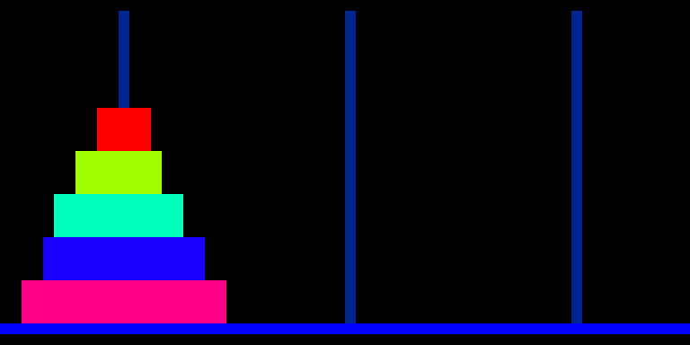
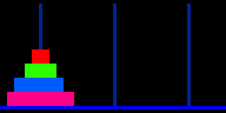

# Towers of Hanoi — RGB LED matrix display

An alternative output for the **Kosmos CP1** Hanoi solver: instead of (or
alongside) the [`robot`](../robot/), the CP1 streams each move to an **Arduino
Mega 2560** that animates the disks on a **64×32 RGB LED matrix**.

The CP1 does the real work — the recursion and the move sequence. This sketch is
just the renderer: it keeps the three-peg tower model, receives each `from→to`
move, and animates the disk **lift → traverse → drop**. Disks are rainbow-colored
by size; three blue pegs rise from a bright blue base line. The display
**auto-resets** for each new run.





It reuses the exact **4-bit move protocol** from the [`robot`](../robot/)
extension, so the CP1 program (`robot/HANOIC-CP1-ROBOT.txt`) needs no changes.

## Hardware

| Item | Notes |
|------|-------|
| Arduino **Mega 2560** | 5 V (matches the CP1 ports → no level shifters); 8 KB RAM holds a 64×32 framebuffer (an Uno's 2 KB cannot) |
| Adafruit **RGB Matrix Shield** | HUB75 adapter + panel-power terminal (needs a small reroute on the Mega, below) |
| **64×32 HUB75** RGB panel | 1/16 scan, A–D address lines |
| **5 V / ≥2 A** supply | powers the panel only, common ground with the Mega |

**Library:** `RGBmatrixPanel` + `Adafruit GFX`. (Adafruit's newer *Protomatter*
has no 8-bit AVR support, so on the Mega `RGBmatrixPanel` is the library to use —
deprecated but stable.)

## Build / flash

```sh
arduino-cli core install arduino:avr
arduino-cli lib install "RGB matrix Panel" "Adafruit GFX Library"
arduino-cli compile --fqbn arduino:avr:mega matrix/hanoi_matrix
arduino-cli upload  --fqbn arduino:avr:mega -p /dev/ttyACM0 matrix/hanoi_matrix
```

Set **`NUM_DISKS`** at the top of the sketch to match the CP1 program's disk
count (CP1 address `008`). 5–7 is the sweet spot for the exhibit (clear disks,
2ᴺ−1 moves ≈ ¾–3 min); up to ~8 still reads clearly, ~13 is the screen/CP1 max
but the disks blur and a full solve takes hours.

## CP1 ↔ Mega link — 5 V direct, **no level shifters**

| CP1 | signal | Mega |
|-----|--------|------|
| Port 2 pin 1 | D0 (move bit 0) | D30 |
| Port 2 pin 2 | D1 (move bit 1) | D31 |
| Port 2 pin 3 | D2 (move bit 2) | D32 |
| Port 2 pin 4 | STROBE (toggles per move) | D33 |
| Port 1 pin 1 | BUSY (Mega → CP1, HIGH while busy) | D34 |
| GND | — | GND (**must be common**) |

Protocol (same as `robot/`): the CP1 waits for `BUSY` low, sets `D0–D2`, toggles
`STROBE`; the Mega latches the code, raises `BUSY`, animates, drops `BUSY`. Move
codes: `1=0→1  2=0→2  3=1→0  4=1→2  5=2→0  6=2→1`. Code `7` forces a reset
(optional — the display also auto-resets when a finished solve is followed by a
new move).

## Matrix wiring — Mega + RGB Matrix Shield

`RGBmatrixPanel` hardwires the six RGB data pins to **PORTA (Mega D24–D29)** and
needs the clock on **PORTB (pin 11)**. The shield is laid out for the Uno, so
reroute two groups of signals:

| Matrix signal | Shield default | Wire to (Mega) | Mod |
|---|---|---|---|
| R1, G1, B1, R2, G2, B2 | D2–D7 | **D24, D25, D26, D27, D28, D29** | cut from D2–D7, jumper to D24–D29 (keep order) |
| CLK | D8 | **D11** | cut from D8, jumper to D11 |
| LAT | D10 | D10 | no change |
| OE | D9 | D9 | no change |
| A, B, C, D | A0–A3 | A0–A3 | no change |

Power the panel from its **own 5 V supply** via the shield screw terminals
(common ground with the Mega) — not from the Mega.

## Credit

The Mega sketch and this document were written by Claude (Opus 4.8), directed by
LambdaMikel — same collaboration as the [paper](../article/hanoi.pdf) and the
[robot](../robot/) extension. The recursive CP1 Hanoi program itself is
LambdaMikel's hand-written work.
